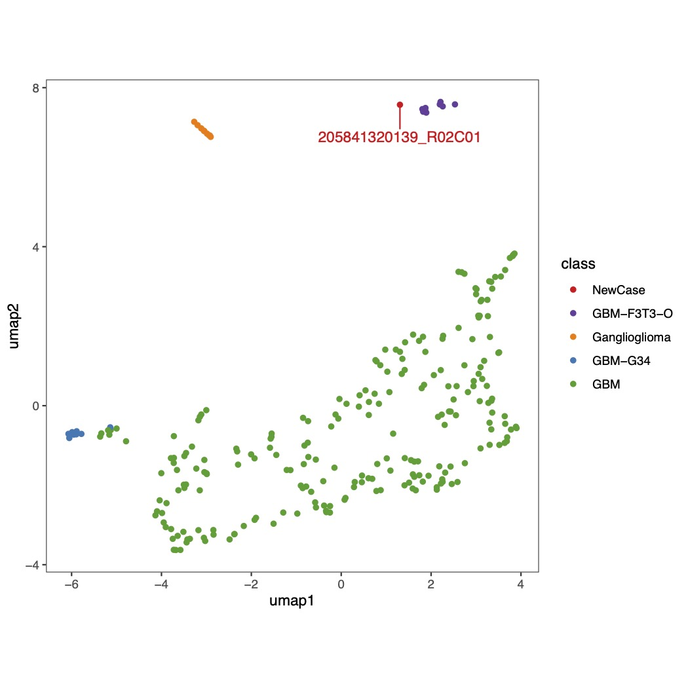

### One R code used to predict UMAP embeding for GBMs.

This code is used to test if tumor samples can embeded with recently identitified FGFR3-TACC3 fusion positive methylation outlier group

Note: Because minfi generated some NaN beta values due to Methy = Umethy = 0, I have to set the NaN beta values to 0.5 as a neutral methylation value.

Referemce: under submission
